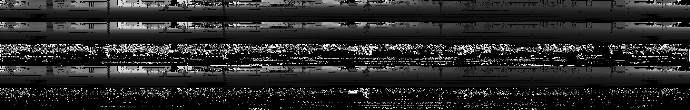
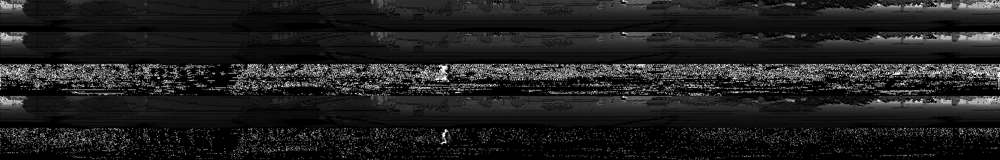
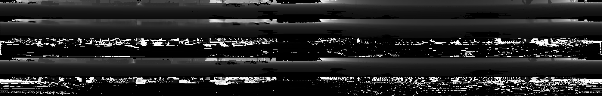
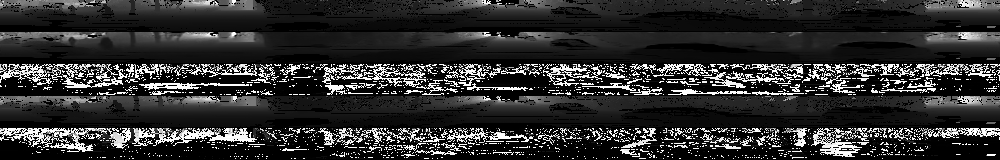

# Range Image Prediction

This framework works for range image sequence prediction, which can also be used for 3D point cloud prediction. 
We project the 3D point cloud into range image in shape 64 x 2000, and use 2D conv LSTM and prednet to predict the image sequences.
Code and models are changed from Prednet by Bill etc.

The architecture is implemented as a custom layer<sup>1</sup> in [Keras](http://keras.io/).
Code and model data is compatible with Keras 2.2.4, Python 3.6, Tensorflow 1.6, cudnn 7.0, Cuda 9.0.

pip install tensorflow-gpu==1.6.0

pip install keras==2.0.8
<br>

## KITTI Demo

Code is included for training the network on the raw KITTI unsynced and unrectified data.

### Steps
1. **Download/process data**
Download the [KITTI raw](http://www.cvlibs.net/datasets/kitti/raw_data.php) data and use the /utils/dataset_preprocessing.py to process data.

The dataset_preprocessing.py contains three functions, which can change point cloud pcd file into range image txt file, point cloud txt file into range image txt file, and change the range image txt file into dataset.npy file. The dataset.npy is for the training, validation, and testing.
Use np.load(npy_file, allow_pickle=True).item() to load data, which contains range image data in ['range_image'] and source name in ['source']. 
You need to change the directory in the code to fit your own dataset.
	```bash
	python /utils/dataset_preprocessing.py
	```
	<br>
	<br>

2. **Train model**
	```bash
	python train.py
	```
	Use --training_data --validation_data to load data, and use --result_dir to specify the validation visualization result directory path.
	--nt changes the time stamps in a prediction iteration. It means use nt images to predict the next image. --rangeimage_size sets the range image size, which set default 64, 2000, 1 here.
	See [Keras FAQ](http://keras.io/getting-started/faq/#how-can-i-run-keras-on-gpu) on how to run using a GPU.
	
	<br>
	<br>

3. **Evaluate model**
	TODO:

### Additional Notes
When training on a new dataset, the image size has to be divisible by 2^(nb of layers - 1) because of the cyclical 2x2 max-pooling and upsampling operations.

### Test Results
The top row of the images is the real image in time frame #10 (groundtruth).
Second row is the predicted image using real images in time frame #0-9
Third row is the differences between predicted image with groundtruth image.
Fourth row is the real image in time frame #9.
Last row is the differences between real image in time frame #9 with time frame #10.

#### campus


```bash
Model MSE: 21.510345
Previous Frame MSE: 41.555820

Model SSIM: 0.847482
Previous Frame SSIM: 0.783482
```

#### road


```bash
Model MSE: 10.711375
Previous Frame MSE: 20.286551

Model SSIM: 0.826418
Previous Frame SSIM: 0.811863
```


#### city


```bash
Model MSE: 23.651453
Previous Frame MSE: 42.781769

Model SSIM: 0.514228
Previous Frame SSIM: 0.484143
```


#### residential


```bash
Model MSE: 8.754193
Previous Frame MSE: 12.637510

Model SSIM: 0.817005
Previous Frame SSIM: 0.809253
```


<br>

<sup>1</sup> Note on implementation:  PredNet inherits from the Recurrent layer class, i.e. it has an internal state and a step function. Given the top-down then bottom-up update sequence, it must currently be implemented in Keras as essentially a 'super' layer where all layers in the PredNet are in one PredNet 'layer'. This is less than ideal, but it seems like the most efficient way as of now. We welcome suggestions if anyone thinks of a better implementation.
